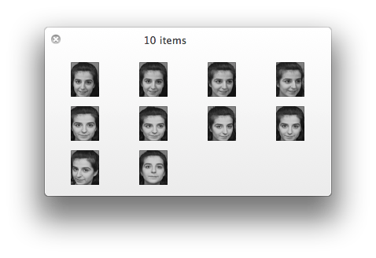
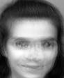
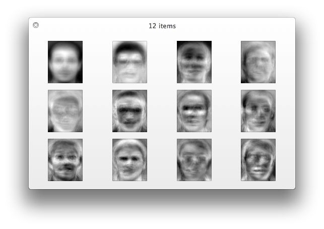
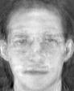

face-recognition
================

Faces recognition example using PCA and eigenfaces

###Experiment
-----------
1. print out  TOP K eigenfaces corresponding to the largest K eigenvalues.
2. rebuild a face with the eigenfaces for  comparison with the original one.
3. face recognition by training data set

###Output
-----------
####average
 

####eigenfaces

####rebuild
origin   rebuild 

####face recognition
correct / testcase ≈ 86% ~ 96%
